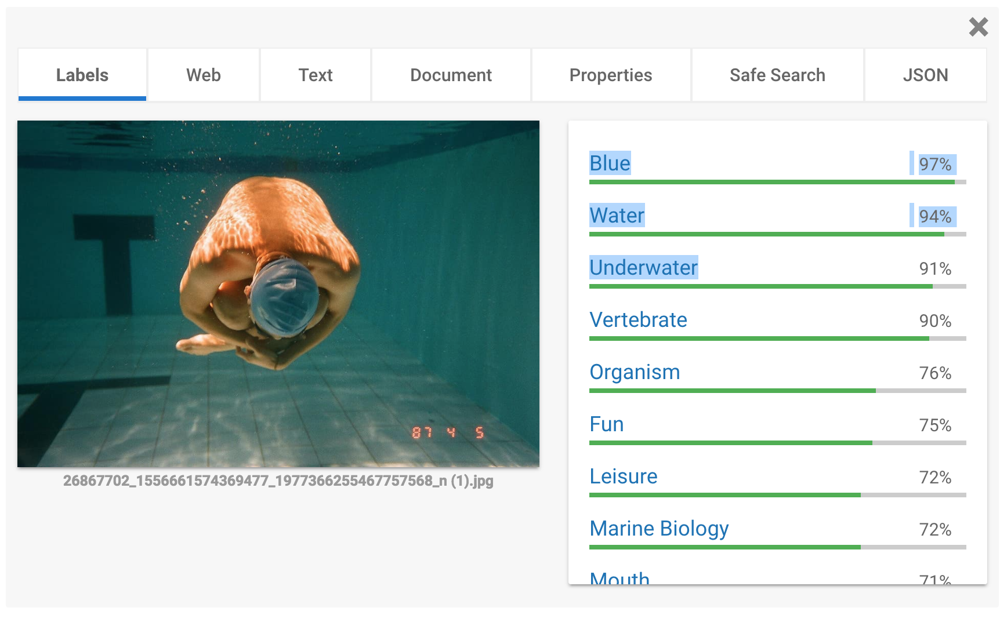

<h1>AWUG III – APPLICACIÓN HYBRIDA - #ASHTAGIT</h1>
<h2>¿QUÉ HACE LA APLICACIÓN?</h2>
Nuestra aplicación permite al usuario subir una foto dentro de la aplicación, y a partir de
diversas apis, ofrecer al usuario los hashtags más usados en esas fotografías que reciben más
likes. 
<h2>PROCESO DE DESARROLLO</h2>
Principalmente desarrollaremos un algoritmo, que permita, a partir de la api de Google
“Google Vision”, subir una foto en la aplicación. A partir de la imagen, la api de google nos
mostrará las palabras clave que representan la imagen. Nuestro algoritmo, filtrará las 10
palabras más usadas y, con la api de Instagram, las comparará con los hashtags más usados
relacionados esas palabras.
Después de ese cálculo, la aplicación, retorna los 10 hashtags más relevantes para aquella foto
en formato de texto “#text”. Con estos hashtags, las fotos que cuelgues en Instagram tendrán
más visibilidad en la plataforma. 
</img>
<h2>USO DE LA APLICACIÓN</h2>
El usuario abre la aplicación. Se muestra dos botones, uno de subir una foto de tu galería y
otro de hacer la foto. Una vez el usuario tiene seleccionada su foto, se muestra dentro de la
aplicación cargada. Aparece un botón para generar los hashtags. Una vez mostrada la lista de
hashtags, que será entre 10 o 20, en cada hashtag aparecerá una forma de seleccionarlo a
partir de un checkbox. El usuario podrá seleccionar o deseleccionar los hashtags que quiera
copiar en el clipboard. Estos hashtags son los más usados y con más relevancia en Instagram,
relacionados con su imagen (que serán procesados gracias a las dos apis). Una vez
seleccionados los hashtags, aparecerá un botón para copiarlos en tu portapapeles.
El uso de la aplicación termina en esta fase y se muestra un feedback para que el usuario sepa
que debe ir a la aplicación de Instagram y colgar su foto con los hashtags que ha copiado.
<h2>AMPLIACION</h2>
A parte de usar Instagram, podemos generar hashtags para twitter, Facebook, Tumblr, etc.
 
<ul>
<h1>
<li>David Abad</li>
 
<li>Aleix Aliaga</li>
 
<li>Bernat Fibla</li>
 
<li>Jan Nafta</li>
 
<li>Vittorio </li>
</h1> 
</ul>